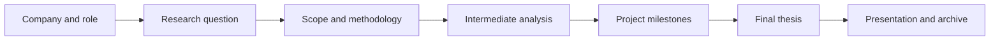

# ETNA Graduation Thesis

This repository contains Thomas Teixeira's ETNA graduation-thesis deliverables, from the initial research question and project framing to the final document.

## Thesis Lifecycle

## Contents

- Initial company, position and topic definition
- Research question and project outline
- Intermediate analysis and project milestones
- Final thesis documents in PDF and editable formats

## Recommended Reading Order

1. Read the initial problem statement and outline.
2. Review the intermediate stages to understand the research progression.
3. Read `etape_5.pdf` or `etape_5.docx` for the final version.

## Document Policy

The repository contains academic deliverables rather than executable source code. PDF files are the stable reading format; DOCX files are retained as editable working documents.

## Purpose

This archive makes the evolution of the thesis transparent and preserves the supporting work completed during the ETNA program.

## Author

Thomas Teixeira

## Status

Graduation-thesis archive maintained for academic reference and presentation.
